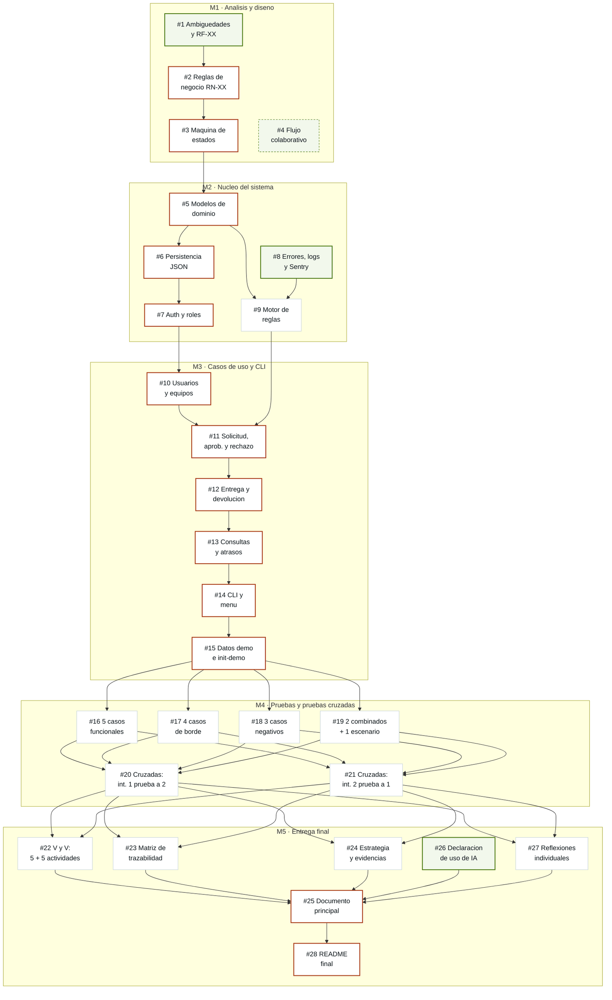

# Grafo de dependencias de los issues

Orden en que se puede trabajar el backlog. Una flecha `A --> B` significa **A
bloquea a B**: B no se puede dar por cerrado hasta que A este fusionado en `main`.

Las dependencias son de contenido, no de archivos. Un issue bloqueado igual se
puede empezar; lo que no se puede es darlo por terminado.

Resumen: **28 issues, 17 niveles de profundidad, 4 tomables hoy.**

## El grafo

Borde naranja: espina serial, no se puede esquivar.
Borde verde: sin bloqueos, se puede tomar hoy.
Borde verde punteado: ya hecho, en revision.

## Tabla de dependencias

| Issue | Titulo | Hito | Depende de | Desbloquea | Dueno |
| --- | --- | --- | --- | --- | --- |
| #1 | Ambiguedades y requerimiento mejorado | M1 | — | #2 | Int. 1 |
| #2 | Reglas de negocio RN-XX | M1 | #1 | #3 | Int. 2 |
| #3 | Maquina de estados del prestamo | M1 | #2 | #5 | Int. 2 |
| #4 | Flujo de trabajo colaborativo | M1 | — | — | Ambos |
| #5 | Modelos de dominio | M2 | #3 | #6, #9 | Int. 1 |
| #6 | Persistencia en archivos JSON | M2 | #5 | #7 | Int. 1 |
| #7 | Autenticacion y control por rol | M2 | #6 | #10 | Int. 2 |
| #8 | Errores, logs de eventos y Sentry | M2 | — | #9 | Int. 2 |
| #9 | Motor de reglas y transiciones | M2 | #5, #8 | #11 | Int. 2 |
| #10 | Registro de usuarios y equipos | M3 | #7 | #11 | Int. 1 |
| #11 | Solicitud, aprobacion y rechazo | M3 | #9, #10 | #12 | Int. 1 |
| #12 | Entrega, devolucion y cancelacion | M3 | #11 | #13 | Int. 2 |
| #13 | Consultas: vigentes, futuros, atrasados | M3 | #12 | #14 | Int. 1 |
| #14 | CLI y menu interactivo | M3 | #13 | #15 | Int. 2 |
| #15 | Datos de demostracion e init-demo | M3 | #14 | #16–#19 | Int. 2 |
| #16 | 5 casos funcionales | M4 | #15 | #20, #21 | Int. 1 |
| #17 | 4 casos de borde | M4 | #15 | #20, #21 | Int. 1 |
| #18 | 3 casos negativos | M4 | #15 | #20, #21 | Int. 2 |
| #19 | 2 combinados y 1 escenario completo | M4 | #15 | #20, #21 | Int. 2 |
| #20 | Pruebas cruzadas: int. 1 revisa a int. 2 | M4 | #16–#19 | #22–#24, #27 | Int. 1 |
| #21 | Pruebas cruzadas: int. 2 revisa a int. 1 | M4 | #16–#19 | #22–#24, #27 | Int. 2 |
| #22 | 5 actividades de verificacion + 5 de validacion | M5 | #20, #21 | #25 | Ambos |
| #23 | Matriz de trazabilidad (10+ req.) | M5 | #20, #21 | #25 | Int. 1 |
| #24 | Estrategia de pruebas y evidencias | M5 | #20, #21 | #25 | Int. 2 |
| #25 | Documento principal integrador | M5 | #22–#24, #26, #27 | #28 | Ambos |
| #26 | Declaracion de uso de IA | M5 | — | #25 | Ambos |
| #27 | Reflexiones individuales | M5 | #20, #21 | #25 | C/u |
| #28 | README final reproducible | M5 | #25 | — | Ambos |

## Los 4 issues tomables hoy

Todo el resto tiene al menos un bloqueo activo.

| Issue | Por que ahora |
| --- | --- |
| **#1** Ambiguedades y RF-XX | Es la raiz del grafo. Bloquea, directa o indirectamente, a 24 de los 28 issues. |
| **#8** Errores, logs y Sentry | Unico issue de codigo sin bloqueos: `errores.py` lo importa todo lo demas. Requiere crear la cuenta en Sentry y obtener el DSN. |
| **#26** Declaracion de uso de IA | Se abre ahora y se va llenando. Reconstruir los prompts al final es como se termina entregando una declaracion incompleta. |
| **#4** Flujo colaborativo | Ya escrito. Falta abrir el PR y que lo revise el companero. |

## Lo que el grafo deja a la vista

### 1. Tres issues de analisis bloquean literalmente todo el codigo

`#1 -> #2 -> #3` es una cadena estricta, y `#3` (maquina de estados) es el
contrato que despues implementa `reglas.py` y verifican las pruebas. Hasta que no
cierre, no hay una sola linea de dominio que se pueda escribir con confianza.

**Correccion:** hacer `#3` entre los dos en una sola sesion, no asignarlo a una
persona. Es el issue con mayor costo de estar mal, y el mas barato de discutir en
voz alta frente a una tabla.

### 2. La espina cambia de dueno ocho veces

Recorriendo la cadena critica, la propiedad salta entre integrantes en
`#1->#2`, `#3->#5`, `#6->#7`, `#7->#10`, `#11->#12`, `#12->#13`, `#13->#14` y
`#15->#25`. Cada salto es una espera: uno termina y el otro recien ahi empieza.

**Correccion:** reasignar `#12` y `#13` para que el bloque `#11-#13` quede en una
sola cabeza. Baja de ocho traspasos a seis y elimina los dos mas frecuentes, que
son los del medio de M3.

### 3. Las pruebas estan todas al final, que es donde no hay tiempo

Los seis issues de M4 dependen de `#15`, o sea de que la aplicacion entera este
terminada. Si M3 se atrasa, se comprimen las pruebas, y las pruebas son
exactamente lo que este ramo evalua.

**Correccion:** los casos de `#16-#19` se pueden *escribir* apenas cierre `#3`,
contra los criterios de aceptacion, mucho antes de que exista el codigo. Fallan
hasta que se implementa, y eso esta bien: mueven trabajo de la cola a hoy y
sirven de definicion ejecutable de cada regla.
