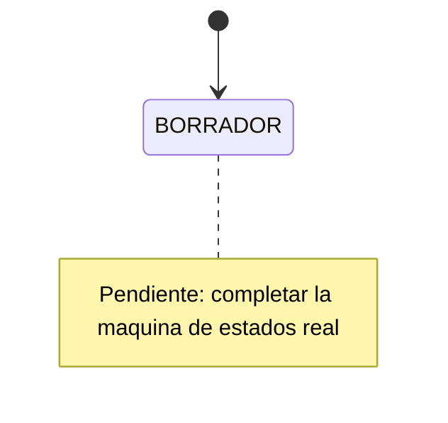

# Estados y reglas del prestamo

## 1. Estados

| Estado | Significado | Es terminal |
| --- | --- | --- |

## 2. Transiciones permitidas

| # | Estado origen | Evento | Estado destino | Rol autorizado | Condiciones que impiden la operacion |
| --- | --- | --- | --- | --- | --- |

## 3. Diagrama

## 4. Calculo de disponibilidad

Definir como se determina si un equipo esta disponible en un rango de fechas:
que estados bloquean, si los rangos son inclusivos, como se tratan los atrasos.
