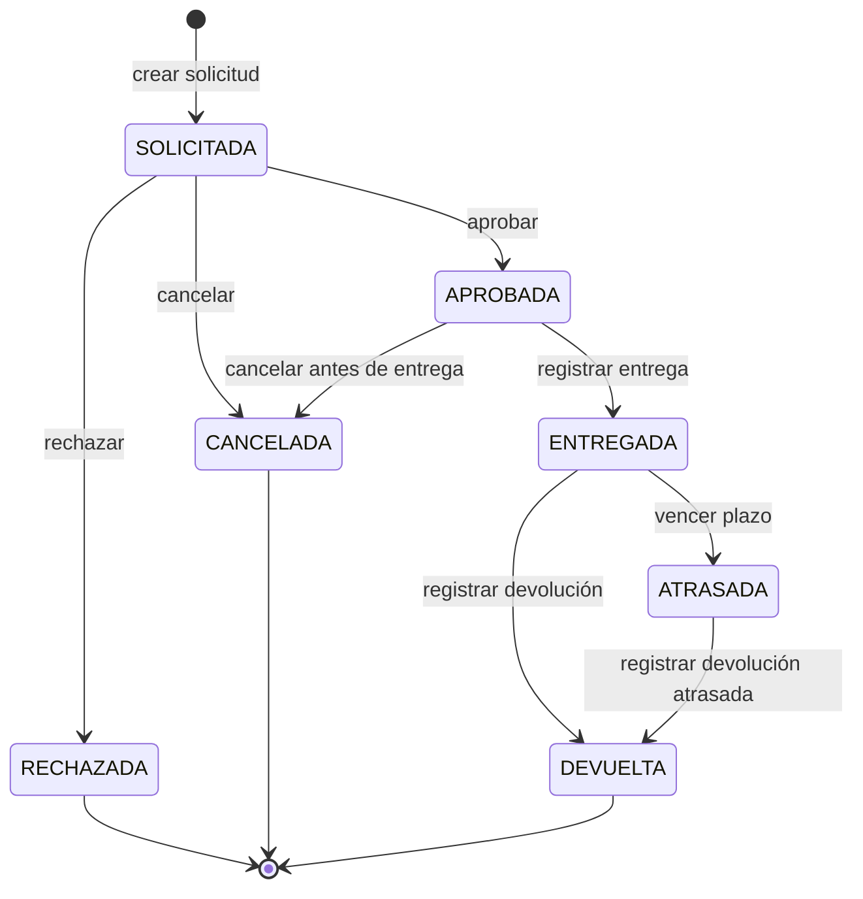

# Estados y reglas del préstamo

Este documento define la máquina de estados que debe respetar la implementación
en `src/prestamos/reglas.py` y en los servicios de solicitudes/préstamos.
También fija las condiciones usadas para calcular disponibilidad.

Corresponde al [Issue #3](https://github.com/nonmeeeeeeeeeeeeeee/sistema-prestamo-equipos/issues/3)
y se basa en [el análisis del requerimiento](analisis-requerimiento.md)
(AMB-04 a AMB-11) y las [reglas de negocio](reglas-negocio.md).
Es un contrato de diseño: las tablas no constituyen evidencia de que el motor
de reglas o los servicios estén implementados ni de que sus pruebas se hayan
ejecutado.

## 1. Estados

| Estado | Significado | Es terminal |
| --- | --- | --- |
| SOLICITADA | Solicitud creada por un solicitante y pendiente de revisión por un encargado. | No |
| APROBADA | Solicitud autorizada por un encargado, con equipos reservados para el período indicado, pero aún no entregados. | No |
| RECHAZADA | Solicitud evaluada y rechazada por un encargado. | Sí |
| CANCELADA | Solicitud anulada antes de la entrega. | Sí |
| ENTREGADA | Equipos retirados por el solicitante; el préstamo está vigente mientras no venza la fecha de término. | No |
| ATRASADA | Préstamo entregado cuya fecha de término venció sin devolución registrada. | No |
| DEVUELTA | Equipos restituidos al laboratorio y préstamo cerrado. | Sí |

Se conserva la nomenclatura femenina de los requerimientos (estado de la
solicitud). Los nombres del issue describen los mismos estados del préstamo:
SOLICITADO = SOLICITADA, APROBADO = APROBADA, RECHAZADO = RECHAZADA,
ENTREGADO = ENTREGADA, DEVUELTO = DEVUELTA, CANCELADO = CANCELADA y
ATRASADO = ATRASADA. No son estados adicionales.

`Inicio` y `[*]` representan creación o finalización en el diagrama; no son
valores que deban persistirse. Los estados terminales no admiten reapertura.

## 2. Transiciones permitidas

| # | Estado origen | Evento | Estado destino | Rol autorizado | Condiciones que impiden la operación |
| --- | --- | --- | --- | --- | --- |
| T-01 | Inicio | Crear solicitud | SOLICITADA | Solicitante | Usuario inactivo o no autenticado; lista de equipos vacía; más de 3 equipos; equipo inexistente o no disponible para el período; se supera el límite de 3 equipos activos; fechas inválidas; duración mayor a 5 días hábiles; inicio en el pasado; inicio a más de 20 días laborales; motivo vacío. |
| T-02 | SOLICITADA | Aprobar solicitud | APROBADA | Encargado | Usuario sin rol encargado; solicitante inactivo; equipo no disponible; solapamiento con otra reserva/préstamo; fechas inválidas o duración mayor a 5 días hábiles; se supera el límite de 3 equipos activos; solicitud ya no está solicitada. |
| T-03 | SOLICITADA | Rechazar solicitud | RECHAZADA | Encargado | Usuario sin rol encargado; solicitud ya no está solicitada; motivo de rechazo vacío. |
| T-04 | SOLICITADA | Cancelar solicitud | CANCELADA | Solicitante dueño / Encargado | Usuario no autorizado; solicitud ya no está solicitada; motivo de cancelación vacío cuando lo ejecuta encargado. |
| T-05 | APROBADA | Cancelar solicitud | CANCELADA | Solicitante dueño / Encargado | Usuario no autorizado; solicitud ya fue entregada; fecha/hora de retiro ya registrada. |
| T-06 | APROBADA | Registrar entrega | ENTREGADA | Encargado | Usuario sin rol encargado; solicitud no está aprobada; equipo no disponible físicamente; fecha de entrega anterior a la fecha de aprobación. |
| T-07 | ENTREGADA | Marcar atraso | ATRASADA | Sistema / Encargado | Fecha actual no supera la fecha de término; préstamo no está entregado; devolución ya registrada. |
| T-08 | ENTREGADA | Registrar devolución | DEVUELTA | Encargado | Usuario sin rol encargado; préstamo no está entregado; faltan equipos por devolver; fecha de devolución anterior a la entrega. |
| T-09 | ATRASADA | Registrar devolución atrasada | DEVUELTA | Encargado | Usuario sin rol encargado; préstamo no está atrasado; faltan equipos por devolver; fecha de devolución anterior a la entrega. |

En toda operación de una persona se exige sesión autenticada y usuario activo
(RN-01 y RN-02). El solicitante solo puede actuar sobre sus propias solicitudes.
Una guarda incumplida impide persistir la transición: se conserva el estado
anterior y se informa un error de dominio (RN-17). Rechazar una operación inválida
no equivale a pasar la solicitud a RECHAZADA; eso solo ocurre mediante T-03.

Las comprobaciones de disponibilidad y límite se repiten al aprobar: otra
solicitud puede haber sido aprobada desde la creación. SOLICITADA no reserva
equipos. El rol «Sistema» de T-07 representa la evaluación temporal de RN-16;
no agrega un tercer rol de usuario ni exige un proceso en segundo plano.

## 3. Diagrama



## 4. Transiciones prohibidas

Estas transiciones se consideran inválidas y deben alimentar casos negativos de
prueba. Toda combinación de estado y evento que no figure en la tabla de
transiciones permitidas debe rechazarse, incluidos los intentos de repetir una
entrega o devolución:

| Estado origen | Evento prohibido | Motivo |
| --- | --- | --- |
| SOLICITADA | Registrar entrega | Toda entrega requiere aprobación previa. |
| SOLICITADA | Registrar devolución | No existe préstamo físico antes de una entrega. |
| APROBADA | Aprobar nuevamente | Una solicitud aprobada ya fue evaluada. |
| APROBADA | Rechazar | El rechazo solo aplica a solicitudes solicitadas. |
| RECHAZADA | Aprobar | Un estado terminal no puede reabrirse. |
| RECHAZADA | Registrar entrega | Una solicitud rechazada no autoriza préstamo. |
| CANCELADA | Aprobar | Un estado terminal no puede reabrirse. |
| CANCELADA | Registrar entrega | Una solicitud cancelada no autoriza préstamo. |
| ENTREGADA | Cancelar | Después de retirar equipos corresponde devolución, no cancelación. |
| ENTREGADA | Aprobar o rechazar | El préstamo ya salió de la etapa de evaluación. |
| ATRASADA | Cancelar | Un préstamo atrasado debe cerrarse con devolución. |
| ATRASADA | Aprobar o rechazar | El préstamo ya salió de la etapa de evaluación. |
| DEVUELTA | Aprobar, rechazar, cancelar o entregar | Un préstamo devuelto está cerrado. |

## 5. Cálculo de disponibilidad

Un equipo se considera disponible para un rango de fechas solicitado solo si se
cumplen todas estas condiciones:

- El equipo existe.
- El estado operativo del equipo es `disponible`.
- El rango solicitado tiene fecha de inicio menor o igual a la fecha de término.
- La duración no supera 5 días hábiles.
- La fecha de inicio no está en el pasado.
- La fecha de inicio no supera 20 días laborales desde el día actual.
- No existe otra solicitud o préstamo del mismo equipo en estado APROBADA o
  ENTREGADA con fechas solapadas.
- No existe un préstamo ATRASADA del equipo pendiente de devolución. Su fecha
  de término original no permite asumir que el equipo ya está disponible.

Los estados que bloquean disponibilidad son:

| Estado | Bloquea disponibilidad | Motivo |
| --- | --- | --- |
| SOLICITADA | No | Aún no fue aprobada; no reserva inventario. |
| APROBADA | Sí | El equipo queda reservado para el período aprobado. |
| RECHAZADA | No | La solicitud fue descartada. |
| CANCELADA | No | La solicitud fue anulada antes de la entrega. |
| ENTREGADA | Sí | El equipo está físicamente en préstamo. |
| ATRASADA | Sí | El equipo no ha sido devuelto y no debe prestarse a otra persona. |
| DEVUELTA | No | El préstamo fue cerrado y el equipo vuelve a estar disponible si su estado operativo lo permite. |

Los rangos de fechas se tratan como inclusivos. Por ejemplo, una reserva del
2026-09-01 al 2026-09-03 bloquea esos tres días completos. Existe solapamiento
cuando:

```text
inicio_solicitado <= termino_existente
y
termino_solicitado >= inicio_existente
```

Los días hábiles/laborales se interpretan como lunes a viernes. No se consideran
feriados institucionales o nacionales en esta versión.

Para T-07 se compara la fecha actual con la fecha de término: en el propio día
de término el préstamo aún está dentro del plazo; desde el día siguiente, sin
devolución registrada, está atrasado. El bloqueo por atraso se mantiene hasta
la devolución, incluso para un rango posterior al término original. Esta es la
interpretación conservadora del bloqueo físico de ATRASADA; no cancela por sí
sola otras reservas ya aprobadas.

Ejemplos para revisar el contrato:

| Situación | Resultado esperado |
| --- | --- |
| Reserva APROBADA del 2026-09-01 al 2026-09-03; nuevo rango del 2026-09-03 al 2026-09-04. | No disponible: ambos rangos incluyen el 3 de septiembre. |
| Misma reserva; nuevo rango del 2026-09-04 al 2026-09-07. | No hay solapamiento con esa reserva; se deben verificar las demás condiciones. |
| Préstamo ENTREGADA con término 2026-09-03, consultado ese mismo día. | Dentro del plazo; no corresponde T-07. |
| Mismo préstamo sin devolución, consultado el 2026-09-04. | ATRASADA; bloquea el equipo hasta registrar devolución. |
| Préstamo DEVUELTA cuyo equipo quedó en mantención. | No disponible: cerrar el préstamo no elimina la restricción operativa. |

## 6. Trazabilidad para implementación y pruebas

Los IDs siguientes ya están definidos en las reglas de negocio. Los CP son
casos previstos: aquí se vinculan al contrato, sin declararlos ejecutados.

| Transición o criterio | Requerimientos | Reglas | Casos previstos |
| --- | --- | --- | --- |
| T-01: creación y validación de solicitud | RF-04, RF-05, RF-06, RF-07 | RN-05, RN-06, RN-07, RN-08, RN-09, RN-17 | CP-07 a CP-16, CP-31, CP-32 |
| T-02: aprobación y revalidación | RF-04, RF-06, RF-07, RF-08 | RN-05, RN-07, RN-08, RN-10, RN-11, RN-12 | CP-07, CP-08, CP-11 a CP-14, CP-17 a CP-22 |
| T-03: rechazo | RF-08 | RN-11, RN-12 | CP-19 a CP-22 |
| T-04 y T-05: cancelación antes de entrega | RF-11 | RN-15 | CP-27, CP-28 |
| T-06: entrega de solicitud aprobada | RF-09 | RN-13 | CP-23, CP-24 |
| T-07: clasificación temporal y atraso | RF-12 | RN-16 | CP-29, CP-30 |
| T-08 y T-09: devolución | RF-10 | RN-14 | CP-25, CP-26 |
| Disponibilidad y solapamiento inclusivo | RF-04, RF-08 | RN-05, RN-10 | CP-07, CP-08, CP-17, CP-18 |

`src/prestamos/reglas.py` deberá validar estados, guardas y disponibilidad con
este contrato. Los servicios de solicitudes y préstamos deberán aplicar solo
las transiciones permitidas y persistir cambios después de validar. Las pruebas
negativas deberán comprobar tanto el error como la conservación del estado y
de los datos anteriores.
