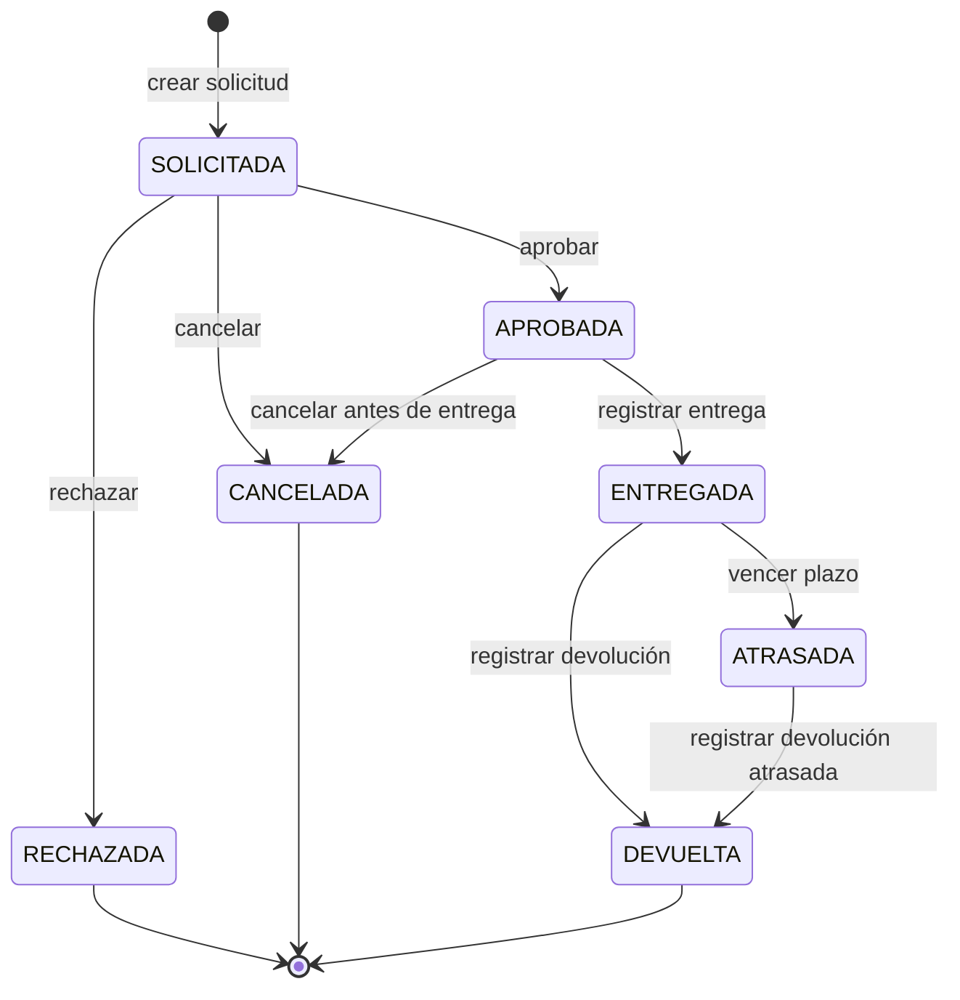

# Estados y reglas del préstamo

Este documento define la máquina de estados que debe respetar la implementación
en `src/prestamos/reglas.py` y en los servicios de solicitudes/préstamos.
También fija las condiciones usadas para calcular disponibilidad.

## 1. Estados

| Estado | Significado | Es terminal |
| --- | --- | --- |
| SOLICITADA | Solicitud creada por un solicitante y pendiente de revisión por un encargado. | No |
| APROBADA | Solicitud autorizada por un encargado, con equipos reservados para el período indicado, pero aún no entregados. | No |
| RECHAZADA | Solicitud evaluada y rechazada por un encargado. | Sí |
| CANCELADA | Solicitud anulada antes de la entrega. | Sí |
| ENTREGADA | Equipos retirados por el solicitante; el préstamo está vigente mientras no venza la fecha de término. | No |
| ATRASADA | Préstamo entregado cuya fecha de término venció sin devolución registrada. | No |
| DEVUELTA | Equipos restituidos al laboratorio y préstamo cerrado. | Sí |

## 2. Transiciones permitidas

| # | Estado origen | Evento | Estado destino | Rol autorizado | Condiciones que impiden la operación |
| --- | --- | --- | --- | --- | --- |
| T-01 | Inicio | Crear solicitud | SOLICITADA | Solicitante | Usuario inactivo o no autenticado; lista de equipos vacía; más de 3 equipos; equipo inexistente; fechas inválidas; duración mayor a 5 días hábiles; inicio en el pasado; inicio a más de 20 días laborales; motivo vacío. |
| T-02 | SOLICITADA | Aprobar solicitud | APROBADA | Encargado | Usuario sin rol encargado; solicitante inactivo; equipo no disponible; solapamiento con otra reserva/préstamo; se supera el límite de 3 equipos activos; solicitud ya no está solicitada. |
| T-03 | SOLICITADA | Rechazar solicitud | RECHAZADA | Encargado | Usuario sin rol encargado; solicitud ya no está solicitada; motivo de rechazo vacío. |
| T-04 | SOLICITADA | Cancelar solicitud | CANCELADA | Solicitante dueño / Encargado | Usuario no autorizado; solicitud ya no está solicitada; motivo de cancelación vacío cuando lo ejecuta encargado. |
| T-05 | APROBADA | Cancelar solicitud | CANCELADA | Solicitante dueño / Encargado | Usuario no autorizado; solicitud ya fue entregada; fecha/hora de retiro ya registrada. |
| T-06 | APROBADA | Registrar entrega | ENTREGADA | Encargado | Usuario sin rol encargado; solicitud no está aprobada; equipo no disponible físicamente; fecha de entrega anterior a la fecha de aprobación. |
| T-07 | ENTREGADA | Marcar atraso | ATRASADA | Sistema / Encargado | Fecha actual no supera la fecha de término; préstamo no está entregado; devolución ya registrada. |
| T-08 | ENTREGADA | Registrar devolución | DEVUELTA | Encargado | Usuario sin rol encargado; préstamo no está entregado; faltan equipos por devolver; fecha de devolución anterior a la entrega. |
| T-09 | ATRASADA | Registrar devolución atrasada | DEVUELTA | Encargado | Usuario sin rol encargado; préstamo no está atrasado; faltan equipos por devolver; fecha de devolución anterior a la entrega. |

## 3. Diagrama



## 4. Transiciones prohibidas

Estas transiciones se consideran inválidas y deben alimentar casos negativos de
prueba:

| Estado origen | Evento prohibido | Motivo |
| --- | --- | --- |
| SOLICITADA | Registrar entrega | Toda entrega requiere aprobación previa. |
| SOLICITADA | Registrar devolución | No existe préstamo físico antes de una entrega. |
| APROBADA | Aprobar nuevamente | Una solicitud aprobada ya fue evaluada. |
| APROBADA | Rechazar | El rechazo solo aplica a solicitudes solicitadas. |
| RECHAZADA | Aprobar | Un estado terminal no puede reabrirse. |
| RECHAZADA | Registrar entrega | Una solicitud rechazada no autoriza préstamo. |
| CANCELADA | Aprobar | Un estado terminal no puede reabrirse. |
| CANCELADA | Registrar entrega | Una solicitud cancelada no autoriza préstamo. |
| ENTREGADA | Cancelar | Después de retirar equipos corresponde devolución, no cancelación. |
| ENTREGADA | Aprobar o rechazar | El préstamo ya salió de la etapa de evaluación. |
| ATRASADA | Cancelar | Un préstamo atrasado debe cerrarse con devolución. |
| ATRASADA | Aprobar o rechazar | El préstamo ya salió de la etapa de evaluación. |
| DEVUELTA | Aprobar, rechazar, cancelar o entregar | Un préstamo devuelto está cerrado. |

## 5. Cálculo de disponibilidad

Un equipo se considera disponible para un rango de fechas solicitado solo si se
cumplen todas estas condiciones:

- El equipo existe.
- El estado operativo del equipo es `disponible`.
- El rango solicitado tiene fecha de inicio menor o igual a la fecha de término.
- La duración no supera 5 días hábiles.
- La fecha de inicio no está en el pasado.
- La fecha de inicio no supera 20 días laborales desde el día actual.
- No existe otra solicitud o préstamo del mismo equipo en estado APROBADA,
  ENTREGADA o ATRASADA con fechas solapadas.

Los estados que bloquean disponibilidad son:

| Estado | Bloquea disponibilidad | Motivo |
| --- | --- | --- |
| SOLICITADA | No | Aún no fue aprobada; no reserva inventario. |
| APROBADA | Sí | El equipo queda reservado para el período aprobado. |
| RECHAZADA | No | La solicitud fue descartada. |
| CANCELADA | No | La solicitud fue anulada antes de la entrega. |
| ENTREGADA | Sí | El equipo está físicamente en préstamo. |
| ATRASADA | Sí | El equipo no ha sido devuelto y no debe prestarse a otra persona. |
| DEVUELTA | No | El préstamo fue cerrado y el equipo vuelve a estar disponible si su estado operativo lo permite. |

Los rangos de fechas se tratan como inclusivos. Por ejemplo, una reserva del
2026-09-01 al 2026-09-03 bloquea esos tres días completos. Existe solapamiento
cuando:

```text
inicio_solicitado <= termino_existente
y
termino_solicitado >= inicio_existente
```

Los días hábiles/laborales se interpretan como lunes a viernes. No se consideran
feriados institucionales o nacionales en esta versión.
